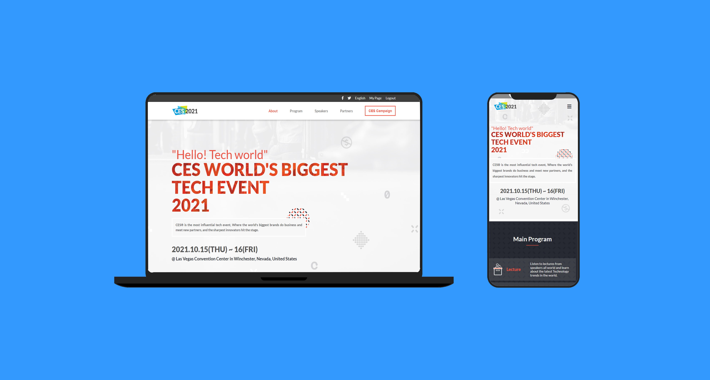

**This Project about CES tech summit 2021 contains the program, speakers, and sponsers**

# Capstone Project 1

  **What I did in this project:**

  1. Created project files using githup work flow.
  2. Make two pages Home and about.
  3. Add mobile menu and Add speakes section dynamically using JS.
  4. Change the content to CES event.
  5. stick to design, colors, and fonts in project requirments. 
  

# Site Live Demo
  [Live Demo Link](https://omar-muhamad.github.io/Capstone-Project-1/)

# Site Screenshots Mockup

   
  

## Built With

- HTML.
- CSS.
- JavaScript.
- Linters.

## Authors

👤 **Omar Muhammad**

- GitHub: [@Omar-Muhamad](https://github.com/Omar-Muhamad)
- Twitter: [@Eng_OmarMuhamad](https://twitter.com/Eng_OmarMuhamad)
- LinkedIn: [@eng-omarmuhammad](https://www.linkedin.com/in/eng-omarmuhammad/)

## Show your support

Give a ⭐️ if you like this project!

## Acknowledgments

- Thanks to [Cindy Shin](https://www.behance.net/adagio07) I used her design to build my project.

